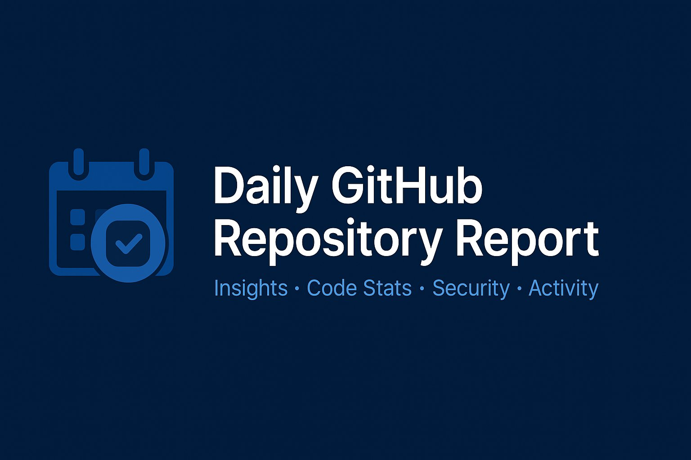

<p align="center">
  <a href="" rel="noopener">
 </a>
</p>

<div align="center">

[]()

[](https://github.com/jfheinrich-eu/github-daily-report/issues)
[](https://GitHub.com/Naereen/StrapDown.js/pull/)
[](https://codecov.io/gh/jfheinrich-eu/github-daily-report)

[](/LICENSE)

</div>


<p align="center">
  GitHub Daily Report Generator (Markdown + Email)
</p>

<h2>Table of Contents</h2>

- [Installation](#installation)
  - [As a GitHub Action](#as-a-github-action)
  - [Local Development](#local-development)
- [Description](#description)
- [Usage](#usage)
  - [As a GitHub Action](#as-a-github-action-1)
  - [Output](#output)
- [Credits](#credits)

## Installation

### As a GitHub Action

Add the following to your workflow YAML to use the Daily Report Action as a Docker container action:

```yaml
- name: Run Daily Report
  uses: jfheinrich-eu/github-daily-report@4d27d4493fe8d12d4e742f3f889790c9d8ded4a7  # v1.0.1
  with:
    GITHUB_TOKEN: ${{ secrets.GITHUB_TOKEN }}
    REPO_NAME: "owner/repo"
    EMAIL_SENDER: "sender@example.com"
    EMAIL_USER: "sender@example.com"
    EMAIL_RECEIVER: "receiver@example.com"
    EMAIL_PASSWORD: ${{ secrets.EMAIL_PASSWORD }}
    OPENAI_API_KEY: ${{ secrets.OPENAI_API_KEY }}
    SMTP_SERVER: "smtp.example.com"
    SMTP_PORT: "587"
```

### Local Development

Clone the repository and install dependencies using Poetry:

```bash
git clone https://github.com/jfheinrich-eu/daily-report.git
cd daily-report
poetry install
```

## Description

**Daily Report** is a GitHub Action and Python tool that generates a daily Markdown summary of recent commits in a GitHub repository.
It leverages OpenAI to analyze commit messages, highlight issues, TODOs, and code smells, and provides actionable recommendations.
The generated report is sent via email and can also be used as an output in your CI/CD workflows.

Typical use cases include:
- Automated daily status reports for development teams
- Code review and quality monitoring
- Integration into dashboards or notification systems

## Usage

### As a GitHub Action

You can schedule the action to run daily, or trigger it manually or on push.
Below is an example workflow that runs the report every day at 06:00 UTC and sends the report via email:

```yaml
name: Daily Report

on:
  schedule:
    - cron: '0 6 * * *'

jobs:
  daily-report:
    runs-on: ubuntu-latest
    steps:
      - name: Checkout repository
        uses: actions/checkout@v4

      - name: Run Daily Report
        uses: ./
        with:
          GITHUB_TOKEN: ${{ secrets.GITHUB_TOKEN }}
          REPO_NAME: "owner/repo"
          EMAIL_SENDER: "sender@example.com"
          EMAIL_USER: "sender@example.com"
          EMAIL_RECEIVER: "receiver@example.com"
          EMAIL_PASSWORD: ${{ secrets.EMAIL_PASSWORD }}
          OPENAI_API_KEY: ${{ secrets.OPENAI_API_KEY }}
          SMTP_SERVER: "smtp.example.com"
          SMTP_PORT: "587"

      - name: Show generated report
        run: echo "${{ steps.daily-report.outputs.report }}"
```

### Output

The action will output the generated Markdown report as `report`, which you can use in subsequent workflow steps.

## Credits

- [Joerg Heinrich](@jfheinrich)
